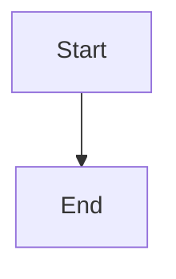
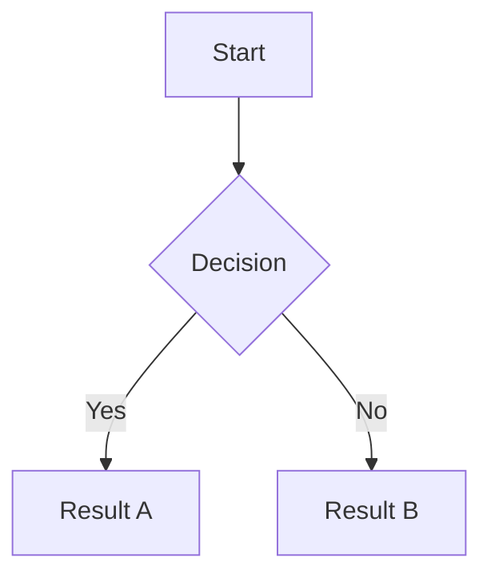
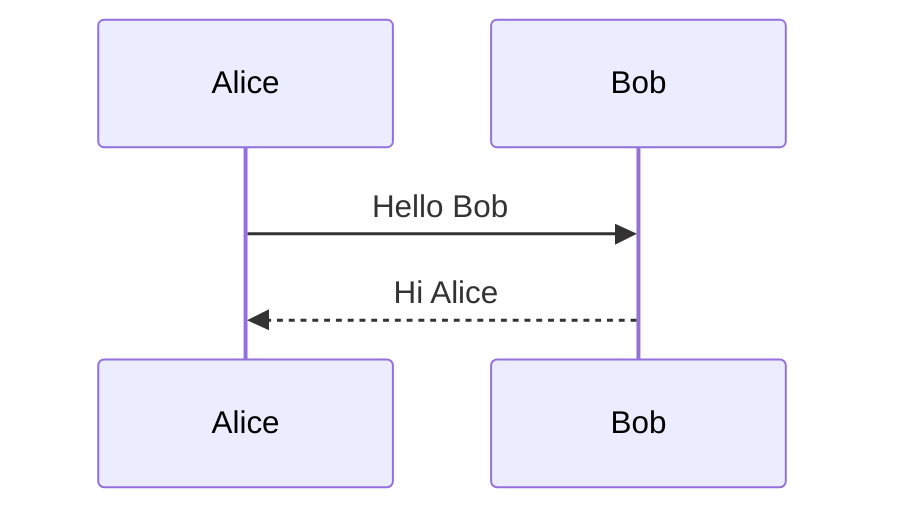
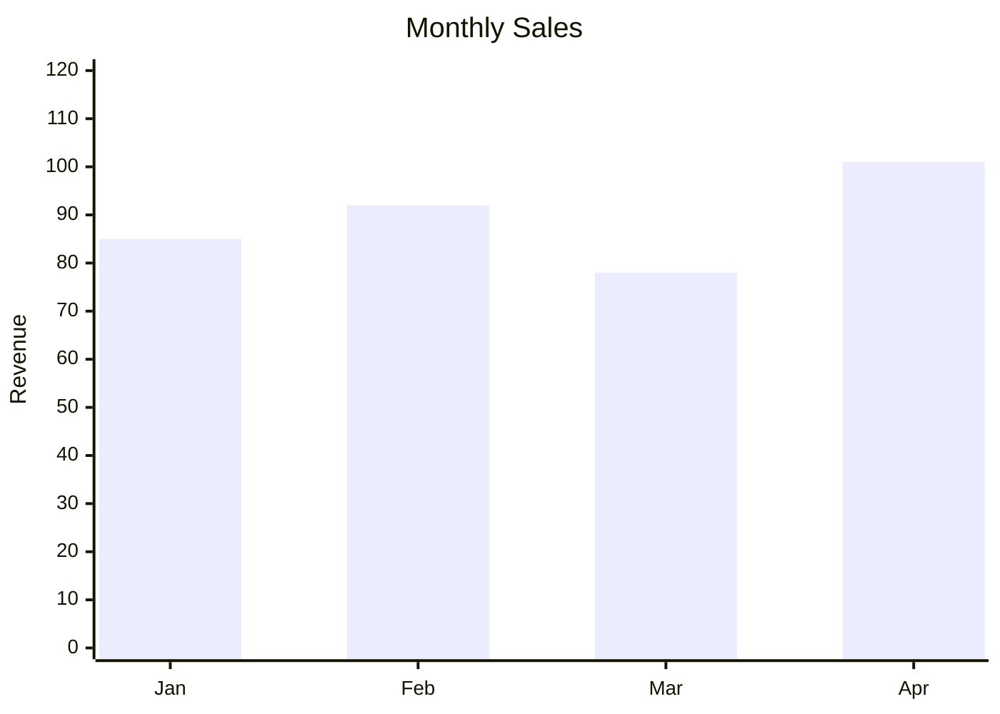

# Mermaid Authoring

Use this reference when the task touches Mermaid fences, Mermaid editor behavior, Smart Insert, CodeLens, or runtime/editor parity.

## Start Here

1. Classify the task:
- supported Mermaid type coverage
- structured editor behavior
- flowchart visual editor behavior
- Mermaid preamble settings
- Smart Insert or CodeLens behavior
- fallback-to-source rules
- template/runtime enablement
2. Decide whether the change is:
- runtime-only
- editor-only
- parity fix
- docs/examples only

## Base Mermaid Block Contract

Mermaid authoring is based on a fenced code block:

````md

````

Important block-detection rules:
- opening line must match exact Mermaid fence syntax
- CodeLens and editor block targeting depend on exact fence detection
- the editor resolves target blocks by line hint, containing fence, then first fence in the document

## Supported Structured Types

The current structured editor supports:
- `graph`
- `sequenceDiagram`
- `classDiagram`
- `stateDiagram-v2`
- `erDiagram`
- `gantt`
- `pie`
- `gitGraph`
- `journey`
- `xychart-beta`

`table` exists in the extension editor type system, but it is a Markdown table editor path, not Mermaid runtime syntax.

## Editor Modes

### Flowchart visual editor

`graph` is handled by a dedicated visual node/edge editor rather than the adapter-based structured parser.

### Structured editors

These use typed adapters and parsers for supported Mermaid families. They are convenient, but only within their supported grammar.

### Source mode fallback

When the current source cannot be represented safely by the structured editor, the editor falls back to source mode. A good skill must teach this explicitly rather than treating it as an error.

## Mermaid Settings and Preamble

The editor shell can control Mermaid settings such as:
- `title`
- `theme`
- `look`
- `flowchart.curve`

Current shell values include:
- theme: `neutral`, `dark`, `forest`, `base`, `default`
- look: `handDrawn`, `classic`
- curve: `linear`, `basis`, `stepBefore`, `stepAfter`, `cardinal`, `monotoneX`

The editor parses and regenerates preamble content while preserving unknown extras where possible. A strong skill must understand that Mermaid authoring is not only the body lines; preamble and init config are part of the contract.

## Smart Insert and CodeLens

### Smart Insert

Smart Insert offers Mermaid starters for:
- flowchart or graph
- XY chart
- pie
- sequence diagram
- class diagram
- state diagram
- ER diagram
- gantt
- git graph
- journey

Those entries can open the Mermaid editor directly.

### CodeLens

CodeLens appears on Mermaid fences and opens the editor for the detected diagram type.

## Fallback and Round-Trip Boundaries

### Flowchart fallback conditions

Flowchart visual editing falls back to source mode when source contains constructs such as:
- `style`
- `classDef`
- `class`
- `click`
- `linkStyle`
- `subgraph`
- `end`
- other unparseable or unsupported directives

### Structured parser fallback conditions

Structured types fall back to source mode when their parser returns `null`.

Example of a practical boundary:
- sequence diagram structured parsing handles participants and messages, but more advanced Mermaid syntax such as `Note` or branching constructs may not round-trip through the structured parser even if helper snippets mention them

This is exactly the kind of boundary a good skill must teach.

## Runtime and Tooling Enablement

There are separate enablement paths:
- template runtime uses project config feature toggles
- extension Mermaid tooling uses extension capability settings

Do not assume enabling one enables the other.

Also note:
- template runtime and extension webview may use different Mermaid loading/version paths
- that means editor preview and site runtime can drift if a Mermaid feature is version-sensitive

## What a Strong Skill Must Explicitly Teach

1. Exact Mermaid fence expectations.
2. Which types are structured, which are flowchart-visual, and which are source-only.
3. Mermaid preamble ownership: title, init block, theme/look/curve settings, and preserved extras.
4. When fallback to source is correct and should be preserved.
5. The difference between runtime enablement and extension tooling enablement.
6. Smart Insert and CodeLens entry points, because they are part of author workflow, not just editor internals.

## Example Blocks

### Flowchart



### Sequence Diagram



### XY Chart



## Practical Editing Guidance

- Use the structured editor when the source stays inside the supported grammar.
- Use source mode when the diagram uses advanced Mermaid syntax or project-specific conventions the structured parser cannot preserve.
- If docs advertise a Mermaid type or setting, verify Smart Insert, CodeLens, editor detection, and runtime preview all understand it.
